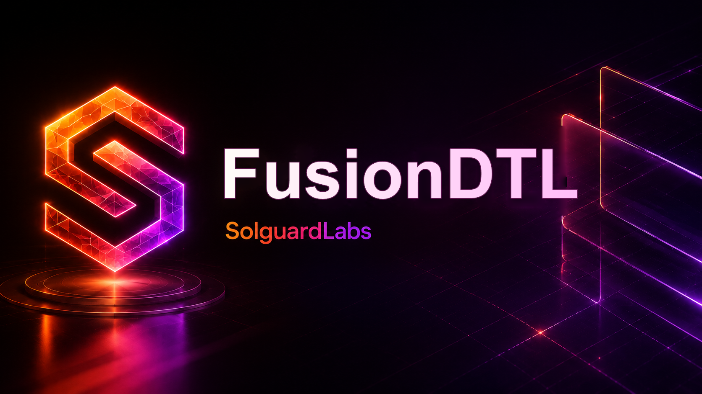

# Fusion DTL



Fusion DTL es un protocolo de liquidacion distribuida escrito en Rust. El
proyecto modela un libro contable con celdas de liquidez, recibos de entrega,
paquetes de liquidacion, operadores autorizados, ventanas operativas, politicas
de capacidad y seguimiento de exposicion por ruta.

El binario principal ejecuta escenarios deterministas y emite reportes JSON
para validar la conservacion de saldos, el estado de las celdas y la superficie
operativa del protocolo.

## Objetivos del Protocolo

- Registrar activos y cuentas con identidades derivadas criptograficamente.
- Gestionar celdas de liquidez con reservas, obligaciones pendientes y limites
  de capacidad.
- Emitir recibos de entrega firmados por el emisor.
- Liquidar paquetes firmados por el beneficiario a traves de rutas autorizadas.
- Aplicar roles operativos para emisores, beneficiarios, relayers, tesoreria y
  controladores de celda.
- Mantener un journal canonico con digests de estado reproducibles.
- Exponer escenarios ejecutables para auditoria funcional y regresion.

## Arquitectura

La logica esta organizada por dominios:

- `amount`: tipos de importe y basis points con operaciones comprobadas.
- `codec`: serializacion canonica para hashes y firmas.
- `crypto`: identidades publicas, claves y firmas Ed25519.
- `delivery`: recibos de entrega y paquetes de liquidacion.
- `fusion`: configuracion y estado de celdas de liquidez.
- `ledger`: libro principal, cuentas, journal y transiciones de estado.
- `market`: activos, venue y observaciones de precio.
- `operators`: roles y configuracion operativa.
- `participants`: perfiles de participantes y attestations internas.
- `routing`: lanes de entrega y quotes de relayer.
- `settlement`: calendario de ventanas de liquidacion.
- `capacity`: politicas de capacidad por celda.
- `risk`: evaluacion de limites de riesgo.
- `treasury`: comisiones y reservas de cobertura.
- `runtime`: CLI y escenarios reproducibles.

## Escenarios Disponibles

El binario acepta un nombre de escenario como argumento:

```bash
cargo run -- snapshot
cargo run -- issue
cargo run -- settle
cargo run -- rebalance
```

Si no se indica escenario, se ejecuta `settle`.

Cada ejecucion devuelve un documento JSON con:

- balances por participante;
- reservas y obligaciones pendientes por celda;
- recibo emitido, si aplica;
- transacciones generadas por el flujo;
- contadores de superficie operativa;
- digest final de estado;
- resultado de conservacion contable.

## Desarrollo

Requisitos:

- Rust `1.96` o superior compatible con la edicion 2024.
- Bun `1.3` o superior.

Instalacion de dependencias JavaScript:

```bash
bun install --frozen-lockfile
```

Comandos principales:

```bash
bun run build
bun run check
bun run test:rust
bun run test:node
bun run test:all
bun run ci
```

Los tests JavaScript se ejecutan con Bun y validan la salida del binario Rust
desde `tests/node`.

## Calidad y CI

El flujo de validacion ejecuta:

- `cargo fmt --all -- --check`
- `cargo clippy --all-targets --all-features --locked -- -D warnings`
- `cargo build --all-targets --locked`
- `cargo test --locked`
- `bun test tests/node`

GitHub Actions reproduce este flujo mediante `.github/workflows/ci.yml`.
Dependabot mantiene actualizadas las dependencias de Cargo, Bun y GitHub
Actions.

## Estado del Repositorio

`Cargo.lock` y `bun.lock` forman parte del repositorio para que las ejecuciones
locales y de CI sean reproducibles. Los directorios `target/` y `node_modules/`
no se versionan.
