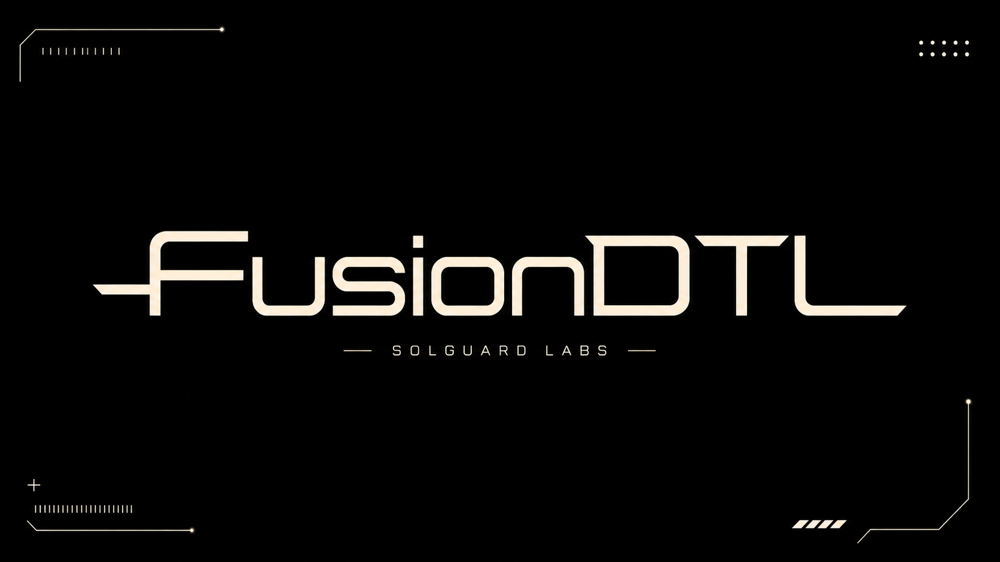
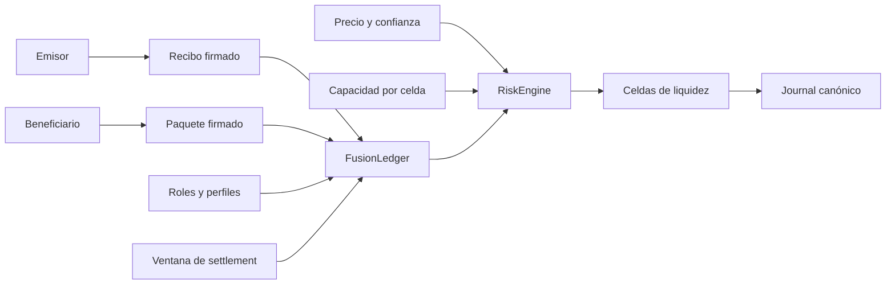
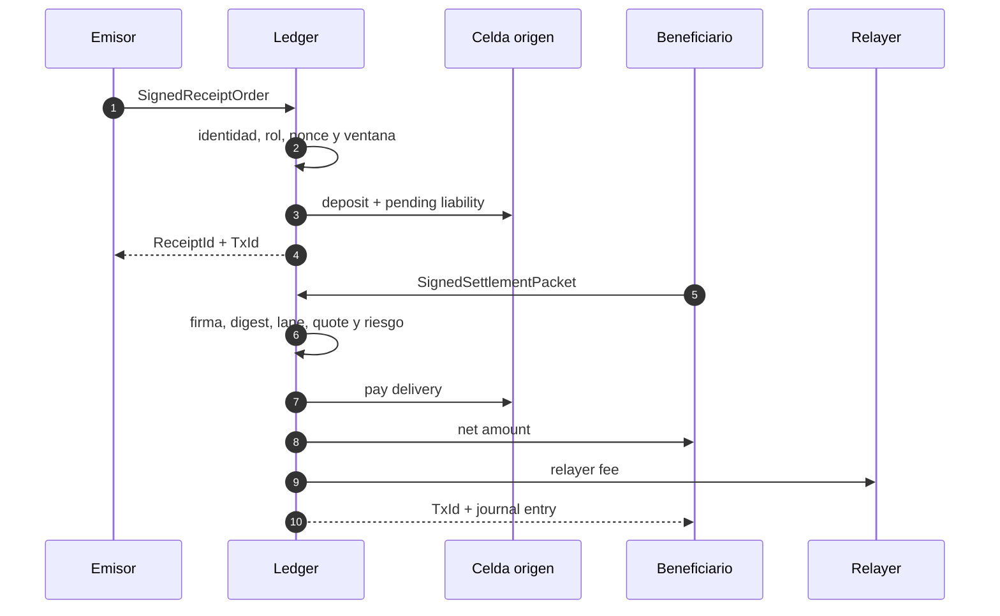
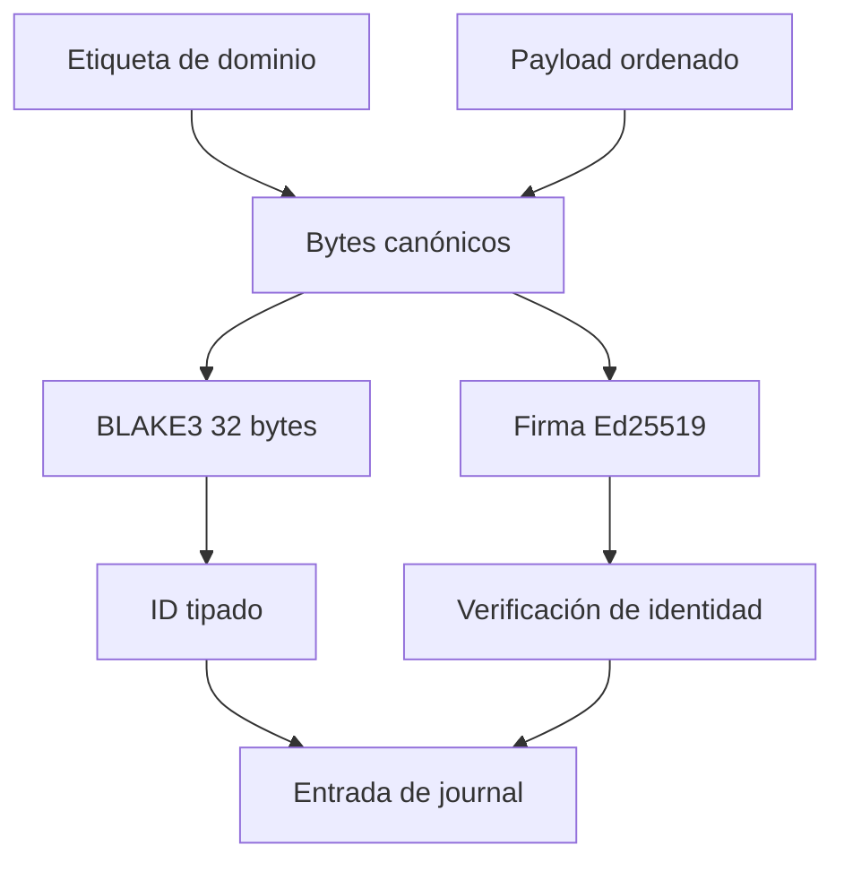
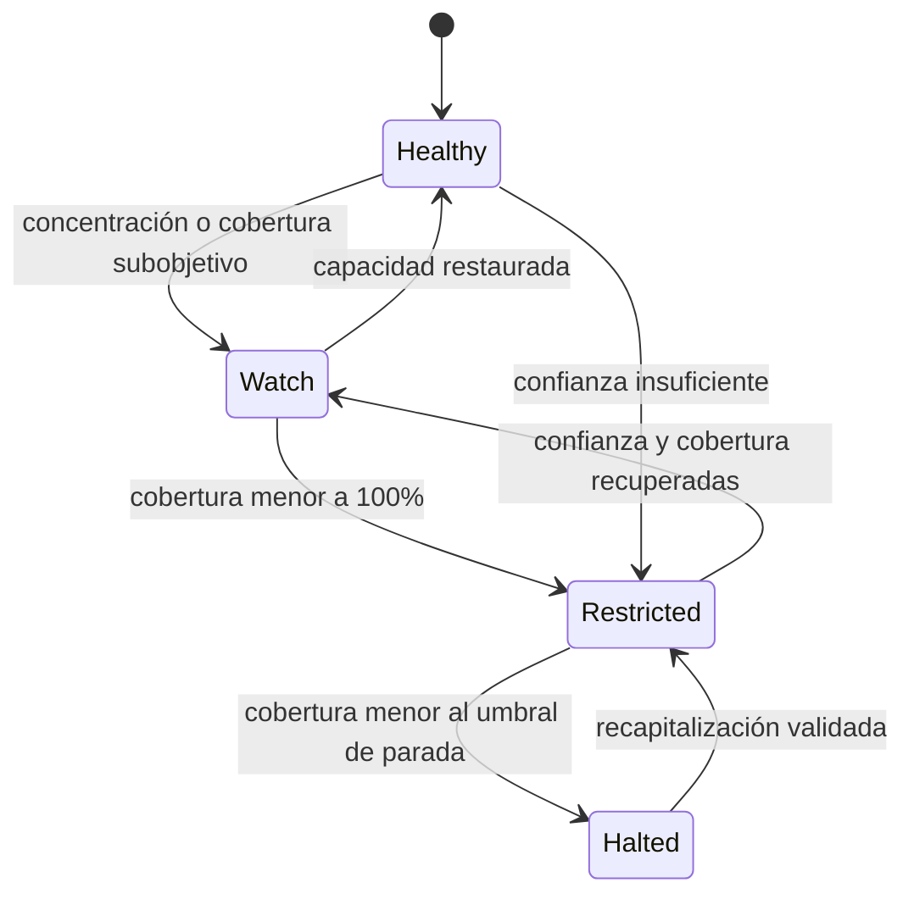

# FusionDTL



FusionDTL es un núcleo de liquidación distribuida para obligaciones firmadas y
reservas segmentadas en celdas. El protocolo coordina emisión de recibos,
enrutamiento, pago, comisiones, ventanas operativas, límites de capacidad,
exposición, tesorería y evidencia canónica dentro de un ledger determinista.

La versión `1.0.0` incluye el motor Rust, cuatro escenarios reproducibles, un
SDK local para Node.js, evaluación preventiva de liquidez y una cadena de
publicación verificada en Linux y Windows.

## Arquitectura


```mermaid
flowchart LR
    Issuer["Emisor"] --> Receipt["Recibo firmado"]
    Receipt --> Ledger["FusionLedger"]
    Beneficiary["Beneficiario"] --> Packet["Paquete firmado"]
    Packet --> Ledger
    Registry["Roles y perfiles"] --> Ledger
    Calendar["Ventana de settlement"] --> Ledger
    Oracle["Precio y confianza"] --> Risk["RiskEngine"]
    Capacity["Capacidad por celda"] --> Risk
    Ledger --> Risk
    Risk --> Cells["Celdas de liquidez"]
    Cells --> Journal["Journal canónico"]
```

Los dominios se mantienen separados: `delivery` define mensajes firmables,
`routing` resuelve lanes y quotes, `fusion` representa celdas, `ledger` aplica
transiciones y `codec` proporciona bytes canónicos para firmas y digests.


```mermaid
sequenceDiagram
    autonumber
    participant I as Emisor
    participant L as Ledger
    participant C as Celda origen
    participant B as Beneficiario
    participant R as Relayer
    I->>L: SignedReceiptOrder
    L->>L: identidad, rol, nonce y ventana
    L->>C: deposit + pending liability
    L-->>I: ReceiptId + TxId
    B->>L: SignedSettlementPacket
    L->>L: firma, digest, lane, quote y riesgo
    L->>C: pay delivery
    L->>B: net amount
    L->>R: relayer fee
    L-->>B: TxId + journal entry
```

## Identidad y evidencia

Las órdenes usan firmas Ed25519. Los identificadores se derivan con dominios
separados y serialización canónica. Cada transición económica añade una entrada
al journal con el digest del estado resultante.


```mermaid
flowchart TD
    Domain["Etiqueta de dominio"] --> Canonical["Bytes canónicos"]
    Payload["Payload ordenado"] --> Canonical
    Canonical --> Digest["BLAKE3 32 bytes"]
    Digest --> ID["ID tipado"]
    Canonical --> Signature["Firma Ed25519"]
    Signature --> Verification["Verificación de identidad"]
    ID --> Journal["Entrada de journal"]
    Verification --> Journal
```

Los tipos `AccountId`, `AssetId`, `CellId`, `ReceiptId`, `PacketId` y `TxId`
evitan mezclar identificadores en las interfaces. `Amount` encapsula `u128` y
las operaciones financieras fallan ante desborde, sustracción inválida o
división por cero.

## Control de liquidez

`LiquidityControlEngine` evalúa celdas sin modificar el ledger. Aplica haircut
a reservas, recuperación parcial a entradas previstas y un factor de presión a
salidas. Calcula cobertura, utilización, déficit y concentración, y clasifica
el resultado como `healthy`, `watch`, `restricted` o `halted`.


```mermaid
stateDiagram-v2
    [*] --> Healthy
    Healthy --> Watch: concentración o cobertura subobjetivo
    Watch --> Healthy: capacidad restaurada
    Watch --> Restricted: cobertura menor a 100%
    Healthy --> Restricted: confianza insuficiente
    Restricted --> Halted: cobertura menor al umbral de parada
    Halted --> Restricted: recapitalización validada
    Restricted --> Watch: confianza y cobertura recuperadas
```

La evaluación complementa los límites transaccionales de `RiskEngine`. Está
pensada para planificación de ventanas, ajuste de capacidad y supervisión de
tesorería.

## Escenarios

```bash
cargo run -- snapshot
cargo run -- issue
cargo run -- settle
cargo run -- rebalance
```

| Escenario   | Propósito                                           |
| ----------- | --------------------------------------------------- |
| `snapshot`  | superficie inicial, reservas, roles y configuración |
| `issue`     | emisión firmada y creación de obligación pendiente  |
| `settle`    | pago local, comisión y cierre de la obligación      |
| `rebalance` | ruta entre celdas y movimiento operativo de reserva |

Cada comando emite JSON con balances, estado de celdas, recibo, transacciones,
contadores, digest y comprobación de conservación.

## Inicio rápido

Requisitos:

- Rust `1.96` o posterior, edición 2024;
- Node.js 24 o posterior;
- npm 11 o posterior.

```bash
npm ci
npm run build
npm run test:all
npm run ci
```

Uso del SDK:

```js
const { FusionClient } = require("./sdk/client");

const fusion = new FusionClient({ timeoutMs: 30_000 });
const report = fusion.run("settle");
const snapshot = fusion.snapshot("issue");

console.log(report.state_digest);
console.log(snapshot.pendingLiabilities);
```

El cliente ejecuta Cargo sin shell intermedio, limita tiempo y memoria de
salida, propaga errores estructurados y valida el contrato JSON antes de
devolver datos.

## Módulos

| Módulo         | Responsabilidad                          |
| -------------- | ---------------------------------------- |
| `amount`       | importes y puntos básicos comprobados    |
| `codec`        | representación canónica                  |
| `crypto`       | identidades y firmas Ed25519             |
| `delivery`     | órdenes, recibos y paquetes              |
| `fusion`       | configuración y estado de celdas         |
| `ledger`       | cuentas, transiciones y journal          |
| `market`       | activos, venue y observaciones de precio |
| `operators`    | roles y configuración de protocolo       |
| `participants` | perfiles, nivel, jurisdicción y vigencia |
| `routing`      | lanes y quotes de relayer                |
| `settlement`   | ventanas operativas                      |
| `capacity`     | límites por celda y activo               |
| `risk`         | autorización transaccional               |
| `treasury`     | comisiones y reserva de cobertura        |
| `operations`   | estrés agregado de liquidez              |
| `sdk`          | integración local para Node.js           |

## Documentación

- [Arquitectura](./docs/arquitectura.md)
- [Modelo económico](./docs/modelo-economico.md)
- [Recibos y settlement](./docs/recibos-y-settlement.md)
- [Criptografía e identidad](./docs/criptografia-e-identidad.md)
- [Seguridad operativa](./docs/seguridad-operativa.md)
- [Integración](./docs/integracion.md)
- [Despliegue](./docs/despliegue.md)
- [Política de seguridad](./SECURITY.md)

## Publicación

Una publicación aceptada mantiene `main`, `production` y el commit pelado del
tag anotado `v1.0.0` en el mismo SHA. La release asociada se denomina
`Production 1.0.0` y ejecuta una comprobación de integridad posterior.

## Licencia

Consulta [LICENSE](./LICENSE).
