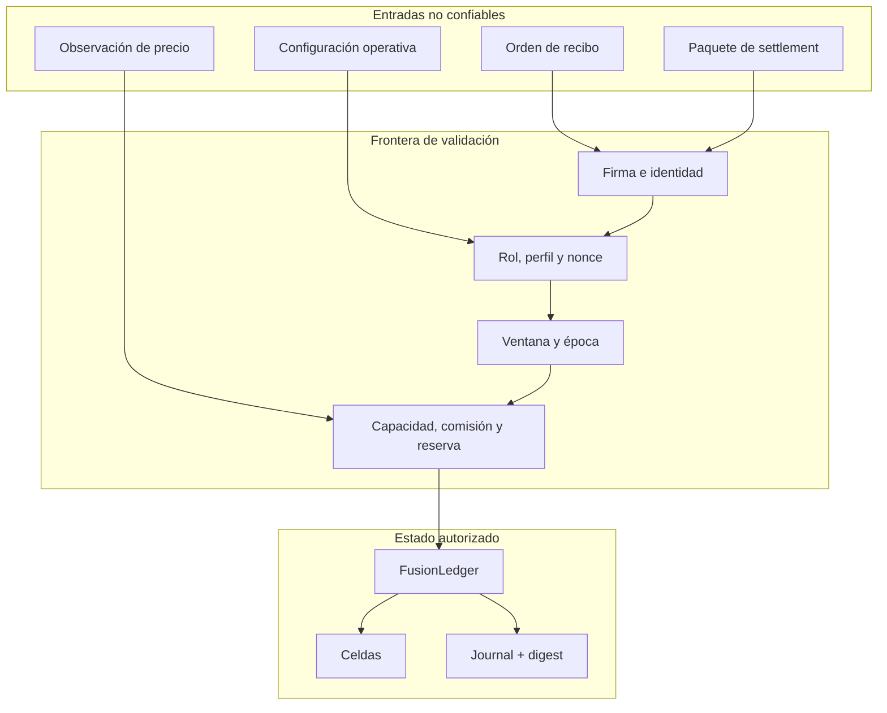
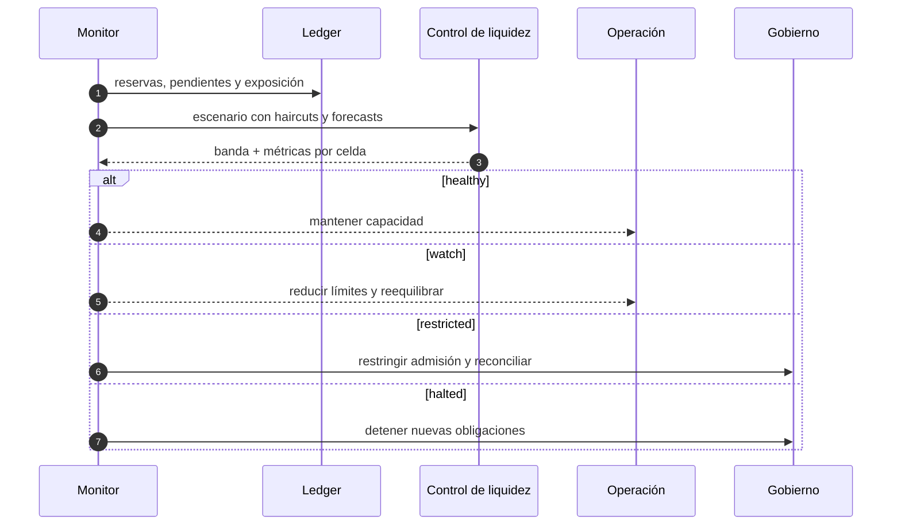

# Política de seguridad de FusionDTL

FusionDTL protege autorización, identidad, contabilidad y entrega mediante
controles independientes. Esta política cubre el núcleo Rust, escenarios, SDK,
scripts y configuración de publicación incluidos en el repositorio.

## Modelo de confianza

Todas las entradas se validan antes de mutar el ledger. El proceso no administra
claves externas, no abre puertos y no realiza llamadas de red. Custodia,
persistencia, transporte y autenticación de servicios pertenecen a los
adaptadores de despliegue.

## Controles de dominio

- Firmas Ed25519 sobre bytes canónicos y separación por dominio.
- Nonces independientes para emisión y settlement.
- IDs tipados para cuentas, activos, celdas, recibos, paquetes y transacciones.
- Perfiles activos con nivel, jurisdicción y vencimiento.
- Roles explícitos para emisión, beneficio, relay, riesgo, tesorería y control.
- Ventanas de settlement con época y tolerancias definidas.
- Lanes con importe, comisión, vigencia y par de celdas autorizados.
- Capacidad por celda y límites de exposición.
- Aritmética monetaria comprobada sobre `u128`.
- Conservación por activo y journal secuencial con digest de estado.
- Evaluación preventiva de liquidez y concentración.

## Matriz de riesgos

| Superficie        | Riesgo operativo                    | Evidencia y control                      |
| ----------------- | ----------------------------------- | ---------------------------------------- |
| Identidad         | suplantación                        | clave pública, firma y bytes canónicos   |
| Mensaje           | repetición o sustitución            | nonce, digest e ID derivado              |
| Participante      | perfil vencido o rol incorrecto     | screening y `OperatorRegistry`           |
| Ventana           | ejecución fuera de periodo          | `SettlementCalendar`                     |
| Lane              | importe o comisión no autorizados   | política y quote de relayer              |
| Celda             | reserva insuficiente                | capacidad, riesgo y operación comprobada |
| Tesorería         | cobertura o concentración degradada | `LiquidityControlEngine`                 |
| Cadena de entrega | referencia o artefacto divergente   | hashes, CI matricial y tag anotado       |

## Secretos y privacidad

No se deben confirmar semillas, claves privadas, tokens, credenciales, datos de
clientes ni material de firma. Una integración debe usar un gestor de secretos,
credenciales efímeras y permisos mínimos. Logs y métricas deben contener IDs y
digests técnicos, nunca secretos ni payloads completos cuando incluyan datos
regulados.

## Respuesta ante incidentes

1. Detener la admisión en las lanes afectadas.
2. Conservar commit, configuración, precios, journal y métricas.
3. Inventariar recibos pendientes y paquetes procesados.
4. Reconciliar balances, reservas, obligaciones y custodia por activo y celda.
5. Delimitar el rango de épocas y transacciones afectado.
6. Preparar corrección y pruebas de regresión con revisión independiente.
7. Promover una versión nueva y reabrir capacidad de forma gradual.

## Comunicación responsable

Usa GitHub Security Advisories para comunicar información sensible de forma
privada. Incluye commit, precondiciones, secuencia mínima reproducible, impacto,
resultado observado, resultado esperado y propuesta de corrección. No publiques
detalles operativos antes de que exista una actualización coordinada.

## Versiones admitidas

| Versión | Estado                 |
| ------- | ---------------------- |
| `1.0.x` | mantenida              |
| `<1.0`  | fuera de mantenimiento |
