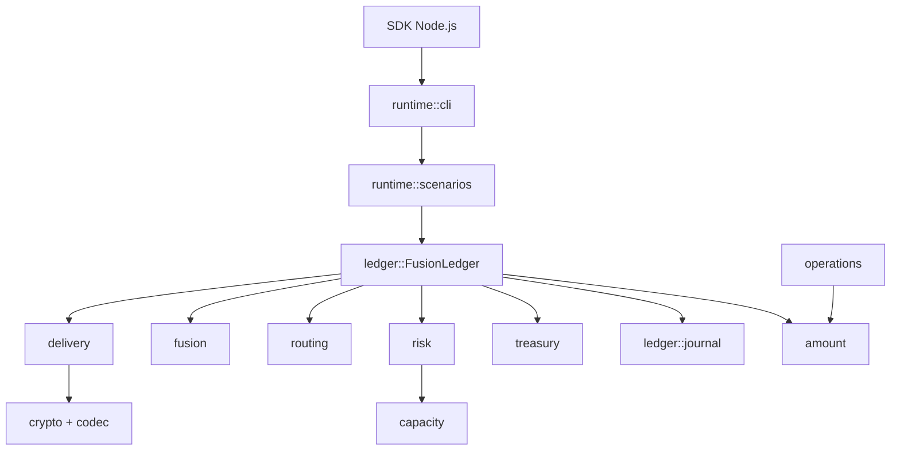
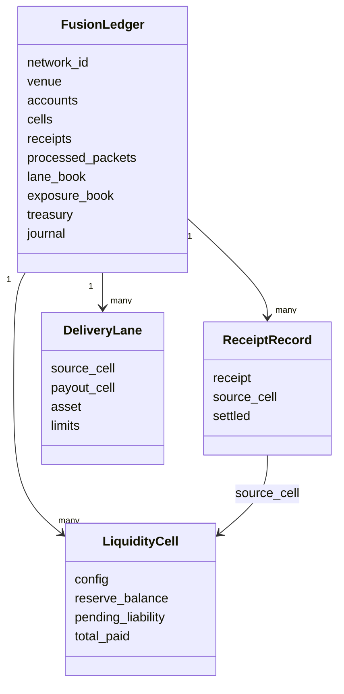
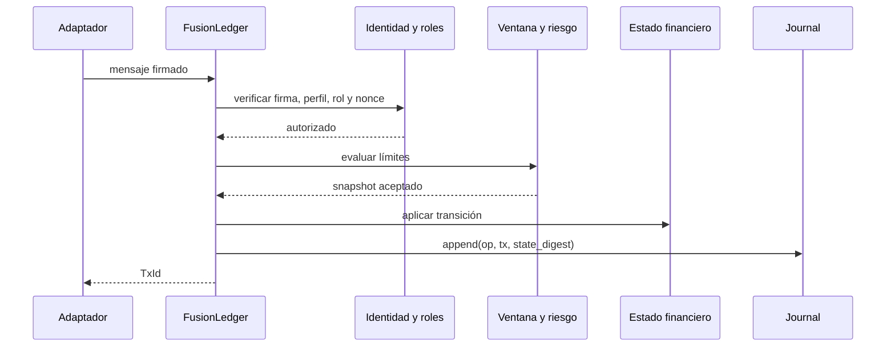

# Arquitectura de FusionDTL

## Principios

FusionDTL organiza la liquidación como una serie de mensajes autorizados y
transiciones deterministas. El ledger es el agregado raíz; los módulos de
dominio no dependen de red, reloj del sistema ni almacenamiento externo.

## Agregados

| Agregado               | Función                                     |
| ---------------------- | ------------------------------------------- |
| cuentas                | saldos, identidad y nonces                  |
| perfiles               | nivel, jurisdicción, estado y vigencia      |
| operadores             | asignación de roles y configuración global  |
| activos y precios      | metadatos, pares, ratio, desviación y época |
| celdas                 | reserva, obligaciones, depósitos y pagos    |
| recibos                | obligación emitida, origen y estado         |
| paquetes procesados    | unicidad de settlement                      |
| lanes y quotes         | rutas autorizadas y precio del relay        |
| capacidad y exposición | límites y acumuladores por celda            |
| tesorería              | comisiones y reserva de cobertura           |
| journal                | secuencia, operación, transacción y digest  |

## Fronteras

`delivery` define los payloads. `crypto` firma y verifica su representación
canónica. `operators`, `participants` y `settlement` deciden si una identidad
puede actuar en una época. `routing`, `capacity` y `risk` aplican la política
económica. `ledger` ejecuta mutaciones en orden y produce evidencia.

Una versión persistente debe envolver estado y evento en la misma transacción o
usar un outbox atómico. El adaptador debe traducir IDs, autenticación y errores
sin introducir dependencias de infraestructura dentro del núcleo.

## Extensión segura

Para añadir una función:

1. definir tipos de entrada y salida de dominio;
2. separar validación pura de mutación;
3. usar `Amount` y `Bps` para valores económicos;
4. derivar IDs con una etiqueta de dominio nueva;
5. registrar una operación de journal estable;
6. añadir pruebas positivas, negativas y deterministas;
7. documentar unidades, redondeo e invariantes.

El módulo `operations` sigue este patrón: consume una fotografía agregada,
produce métricas y no tiene acceso mutable al ledger.
