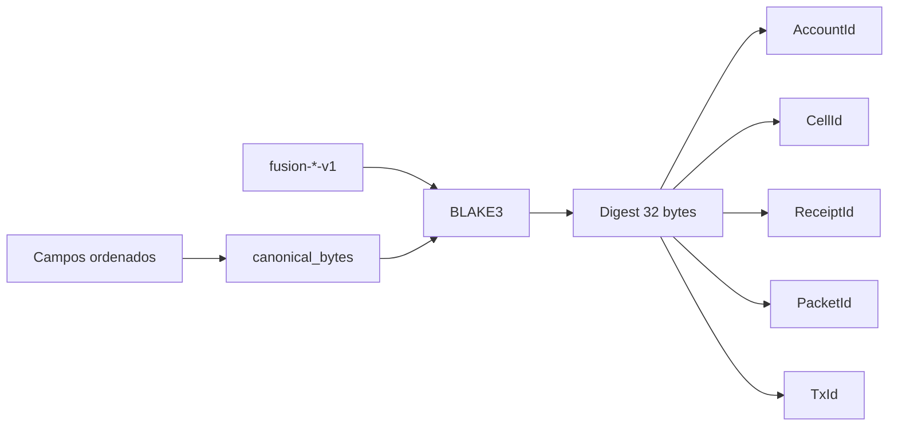
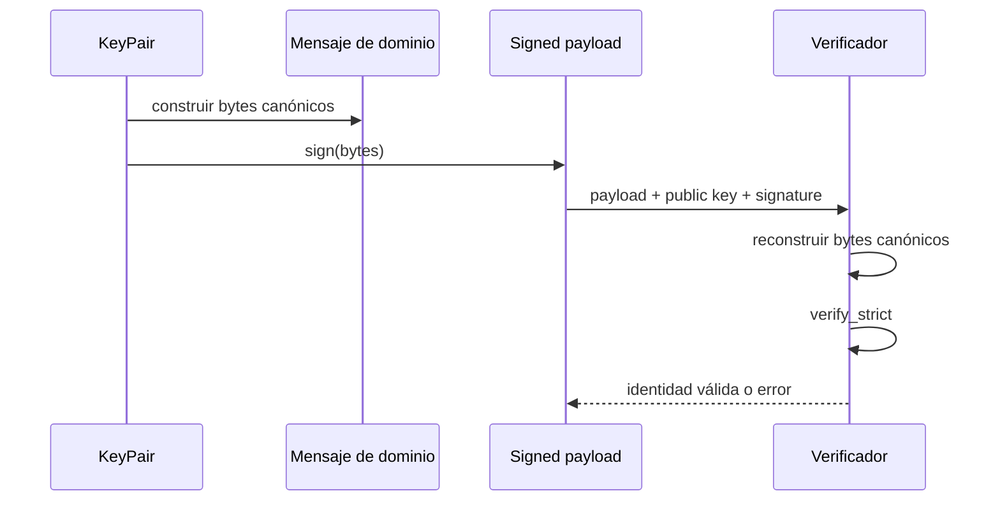
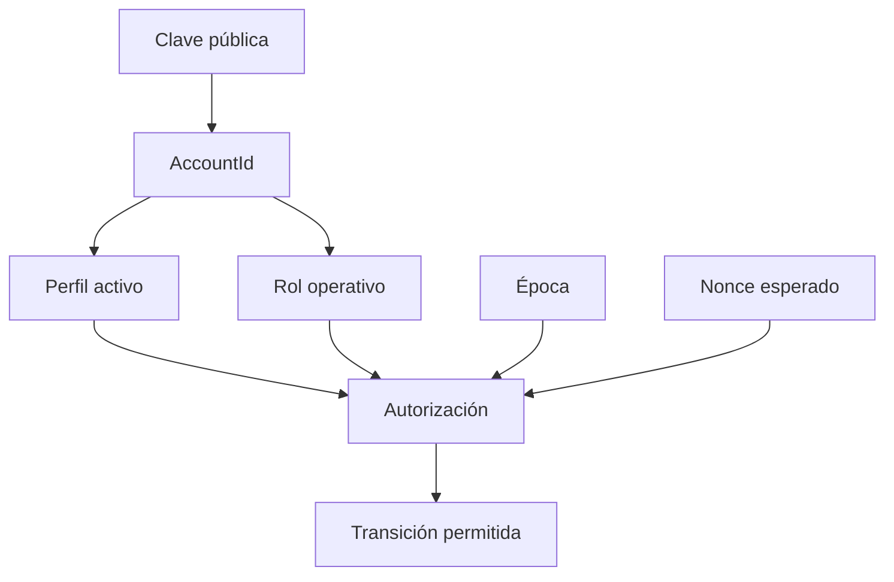

# Criptografía e identidad

## Separación por dominio

FusionDTL deriva digests BLAKE3 de 32 bytes. Cada familia usa una etiqueta
distinta para impedir que los mismos bytes tengan significado intercambiable.

La codificación incluye longitudes de las partes. Esto evita concatenaciones
ambiguas como `ab + c` frente a `a + bc`.

## Firmas

Las órdenes se firman con Ed25519. La verificación debe recibir exactamente el
mismo payload canónico y dominio que la firma.

Las semillas y claves privadas no forman parte del modelo serializado ni deben
aparecer en journal, logs, errores o métricas.

## IDs tipados

Aunque todos los IDs contienen 32 bytes, Rust los representa con tipos
distintos. Una función que espera `CellId` no acepta accidentalmente un
`ReceiptId`. La serialización externa usa hexadecimal minúsculo de 64
caracteres.

| ID          | Entradas principales                                     |
| ----------- | -------------------------------------------------------- |
| `AssetId`   | símbolo y decimales                                      |
| `CellId`    | controlador, activo, lane y salt                         |
| `ReceiptId` | red, beneficiario, activo, importe, nonce y route digest |
| `PacketId`  | red, celda, recibo, relayer y nonce                      |
| `TxId`      | operación y material de transición                       |

## Rotación y custodia

Una integración debe almacenar claves en HSM o gestor autorizado, asignar una
identidad por función, rotar con doble control y mantener una lista de claves
revocadas. Una rotación no debe reutilizar nonces ni alterar el historial de la
identidad anterior.

## Reglas de implementación

- No cambiar etiquetas de dominio dentro de una versión menor.
- No serializar mapas sin orden estable.
- No convertir importes a coma flotante.
- Comparar firmas y digests mediante bibliotecas mantenidas.
- Validar red, época y nonce además de la firma.
- Versionar explícitamente cualquier formato externo nuevo.
