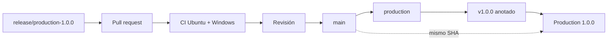
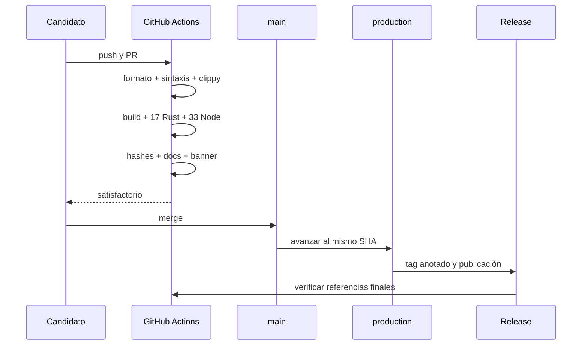
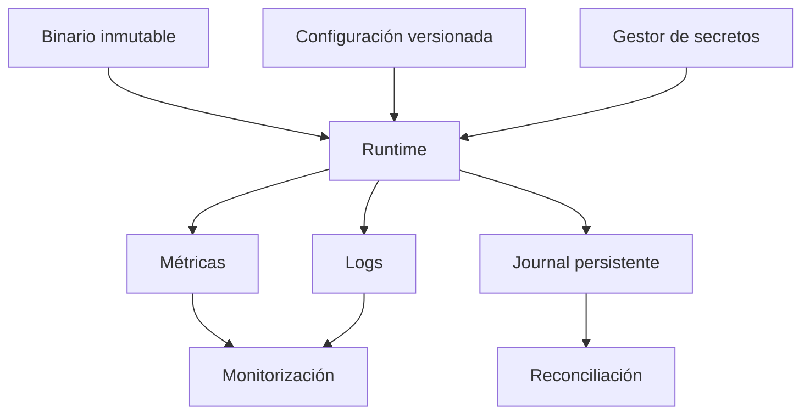

# Despliegue y publicación

## Artefacto inmutable

La promoción parte de un commit revisado. `main`, `production` y el tag anotado
deben resolver al mismo commit; no se recompone código entre etapas.



## Entorno

| Componente | Requisito                        |
| ---------- | -------------------------------- |
| Rust       | `>=1.96`, edición 2024           |
| Cargo      | `Cargo.lock` obligatorio         |
| Node.js    | `>=24`                           |
| npm        | `>=11`, instalación con `npm ci` |
| CI         | Ubuntu y Windows                 |
| permisos   | contenido en modo lectura        |

```bash
npm ci
npm run ci
git status --short
```

## Pipeline



El workflow de integridad se ejecuta en `main`, `production`, tags y evento de
release. Cuando las referencias finales existen, resuelve el tag anotado y
compara los tres commits.

## Configuración externa

Una instancia conectada debe recibir parámetros mediante archivos montados o
variables gestionadas, y secretos desde un almacén autorizado. Se recomienda:

- identidad diferente por entorno y función;
- red de salida cerrada salvo destinos explícitos;
- límites de CPU, memoria y tiempo;
- logs estructurados con redacción;
- métricas de reservas, pendientes, exposición y cobertura;
- hash de configuración junto al commit ejecutado;
- backups cifrados y restauraciones ensayadas.



## Reversión

La reversión selecciona una publicación anterior completa. Primero se detiene
admisión, se conserva el estado, se inventarían obligaciones pendientes y se
comprueba compatibilidad. Después se restaura el artefacto, se reproduce el
journal desde un punto conocido y se reabre con capacidad limitada.

## Criterios de aceptación

- [ ] suite local y árbol limpio;
- [ ] PR con ambos sistemas en verde;
- [ ] versiones Cargo y npm en `1.0.0`;
- [ ] documentación y banner verificados;
- [ ] cuatro blobs económicos preservados;
- [ ] `main`, `production` y tag alineados;
- [ ] release final no draft ni prerelease;
- [ ] integridad posterior satisfactoria.
