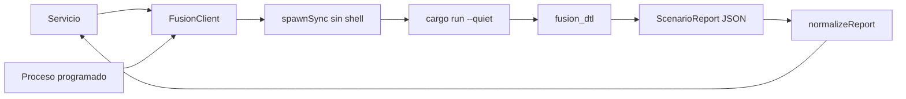
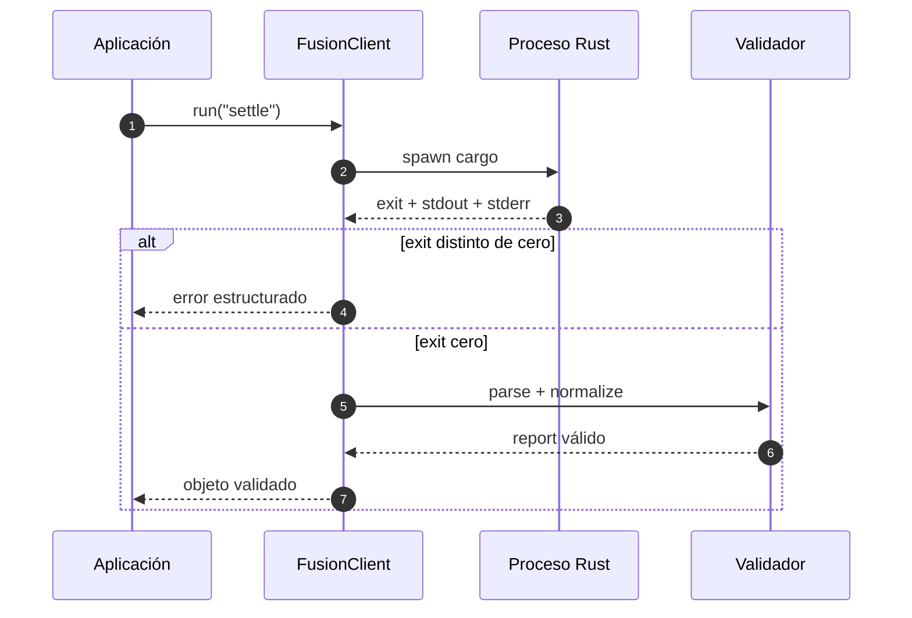
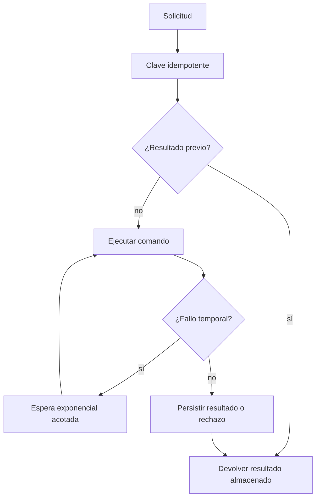

# Integración

## CLI y SDK

El binario acepta un escenario y produce un objeto JSON por `stdout`. El SDK
Node.js proporciona una frontera estable para automatización local.



```js
const { FusionClient } = require("./sdk/client");

const client = new FusionClient({
    timeoutMs: 30_000,
    env: { RUST_BACKTRACE: "0" },
});

const report = client.run("snapshot");
const view = client.snapshot("issue");
```

## Contrato de informe

| Grupo          | Contenido                                         |
| -------------- | ------------------------------------------------- |
| raíz           | escenario, red, journal, digest y conservación    |
| `asset`        | ID, símbolo y decimales                           |
| `balances`     | saldos de las seis identidades del escenario      |
| `cells`        | reserva y obligación de core y edge               |
| `receipt`      | recibo completo o `null`                          |
| `transactions` | lista ordenada de `TxId`                          |
| `surface`      | contadores de registros, roles, lanes y políticas |

El normalizador exige enteros seguros no negativos y un digest hexadecimal de
32 bytes. Los campos económicos se conservan como enteros; para importes por
encima del rango seguro de JavaScript, una futura versión debe usar cadenas
decimales y versionar el esquema.



## Errores y reintentos

Clasifica por separado:

- proceso ausente o entorno incompleto;
- tiempo máximo;
- salida no satisfactoria;
- JSON mal formado;
- esquema inválido;
- rechazo funcional de dominio.

Solo los fallos temporales del adaptador deben reintentarse automáticamente.
Un rechazo de firma, nonce, época, capacidad o riesgo requiere corregir la
entrada o esperar un cambio de estado.



## Adaptador persistente

Una integración HTTP, RPC o cola debe autenticar en el borde, validar tamaños,
asignar claves de correlación y confirmar estado más evento atómicamente. No
debe introducir objetos de red, conexiones o credenciales dentro de los tipos
de dominio.

## Compatibilidad

`1.0.x` mantiene nombres, significado y unidades del informe. Añadir un campo
es compatible para consumidores tolerantes; retirar, renombrar o cambiar una
unidad exige una versión mayor.
