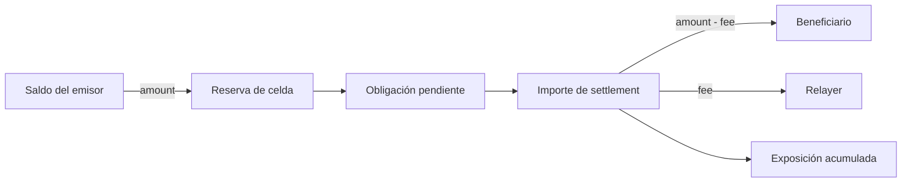
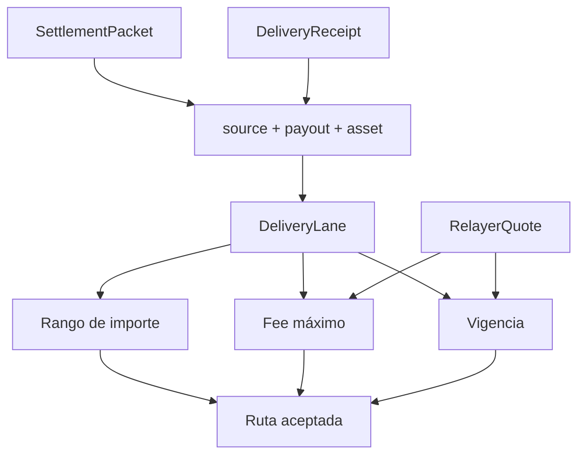
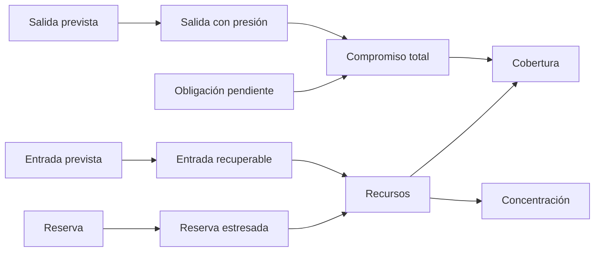

# Modelo económico

## Flujo de valor

Un recibo representa una obligación denominada en un activo. Durante la
emisión, el importe se mueve desde el saldo del emisor hacia la reserva de una
celda y aumenta su obligación pendiente. Durante el settlement, el importe se
divide entre beneficiario y relayer según la quote autorizada.



La conservación por activo compara balances de participantes y reservas de
celdas con el suministro registrado. Las comisiones no crean unidades: se
deducen del importe bruto.

```text
beneficiary_amount = receipt_amount - relayer_fee
beneficiary_amount + relayer_fee = receipt_amount
observed_supply = sum(account_balances) + sum(cell_reserves)
observed_supply = registered_supply
```

## Política de lane

Una lane identifica celdas, activo, importe mínimo y máximo, comisión máxima y
época de vigencia. La quote del relayer añade identidad, precio y expiración.



Los parámetros deben calibrarse por profundidad, latencia de reposición,
coste de relay, volatilidad y horario operativo. Una lane de alta capacidad no
debe heredar automáticamente la misma comisión o vigencia que otra ruta.

## Capacidad y exposición

La política de capacidad limita emisión, reserva y volumen operativo. El libro
de exposición registra importes emitidos, liquidados y enrutados por celda. Las
dos vistas permiten separar capacidad configurada de uso observado.

| Magnitud     | Interpretación                                  |
| ------------ | ----------------------------------------------- |
| `issued`     | obligaciones originadas en la celda             |
| `settled`    | obligaciones cerradas                           |
| `routed_in`  | volumen pagado por la celda en rutas            |
| `routed_out` | volumen originado y dirigido a una ruta         |
| `reserve`    | unidades depositadas disponibles para operación |
| `pending`    | obligación todavía abierta                      |

## Estrés de liquidez

El control preventivo usa estas ecuaciones por celda:

```text
stressed_reserve    = reserve × (10_000 - haircut_bps) / 10_000
recoverable_inflow  = forecast_inflow × recovery_bps / 10_000
stressed_outflow    = forecast_outflow × (10_000 + surge_bps) / 10_000
commitments         = pending_liability + stressed_outflow
resources           = stressed_reserve + recoverable_inflow
coverage_bps        = resources × 10_000 / commitments
concentration_bps   = resources_cell × 10_000 / resources_portfolio
```



## Bandas

| Banda        | Criterio dominante                              | Respuesta operativa            |
| ------------ | ----------------------------------------------- | ------------------------------ |
| `healthy`    | cobertura objetivo y señales dentro de política | mantener capacidad             |
| `watch`      | cobertura subobjetivo o concentración elevada   | reducir límites y reequilibrar |
| `restricted` | cobertura menor a 100% o confianza insuficiente | restringir nuevas obligaciones |
| `halted`     | cobertura menor al umbral de parada             | detener admisión y reconciliar |

Las bandas son conservadoras: el resultado agregado toma la peor clasificación
de sus celdas. Una posición fuerte no oculta una celda degradada.
