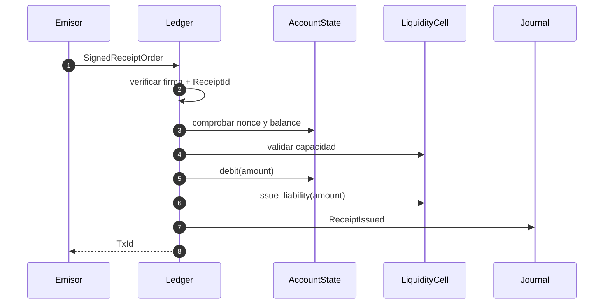
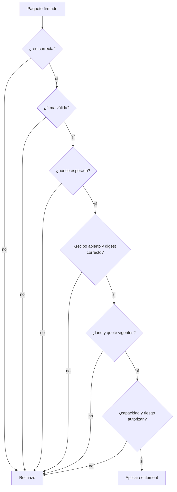
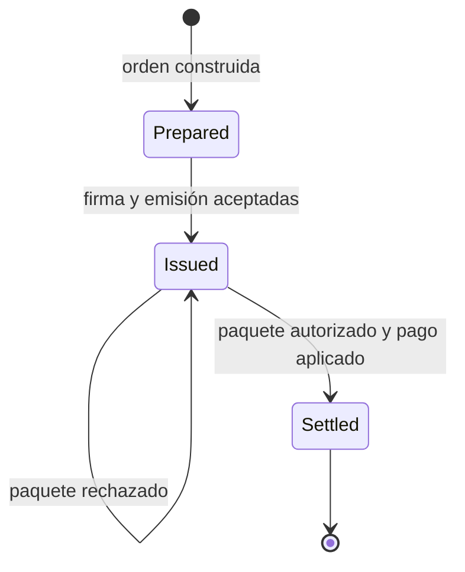

# Recibos y settlement

## Emisión

`ReceiptOrder` contiene red, celda, emisor, beneficiario, activo, importe,
nonce, madurez y digest de ruta. El emisor firma su representación canónica y
el ledger verifica identidad, perfil, rol, época y nonce antes de aceptar.



Una respuesta satisfactoria confirma que la obligación fue registrada. No
confirma todavía el pago al beneficiario.

## Paquete de settlement

`SettlementPacket` referencia recibo, celda de pago, beneficiario, relayer,
comisión, nonce, época y digest del recibo. El beneficiario lo firma para
autorizar el destino económico de la operación.



## Distribución

Para un recibo de `2_500_000_000` y una comisión de `5_000_000`:

```text
importe bruto       2_500_000_000
comisión relayer        5_000_000
importe beneficiario 2_495_000_000
```

La comisión debe ser menor o igual al máximo de la lane y al límite global de
riesgo. La resta usa aritmética comprobada.



## Seguimiento

El consumidor debe relacionar:

- clave idempotente externa;
- `ReceiptId` y nonce del emisor;
- `PacketId` y nonce del beneficiario;
- `TxId` de emisión y settlement;
- índice y digest de journal;
- época y configuración efectivas.

Un reintento por pérdida de respuesta debe consultar esta relación antes de
reenviar. El almacenamiento externo debe imponer unicidad sobre la clave
idempotente y confirmar el resultado junto con el evento procesado.

## Reconciliación

Al cerrar una ventana, compara recibos emitidos con paquetes procesados,
obligaciones pendientes, reservas, pagos, comisiones y exposición. Toda
diferencia debe conservarse como incidencia; no se corrige editando balances.
