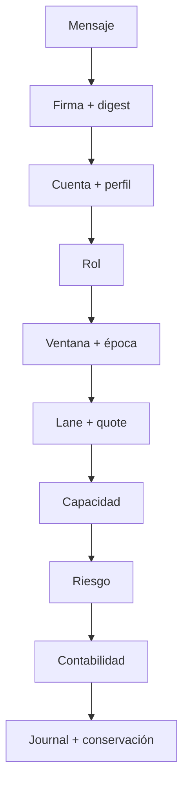
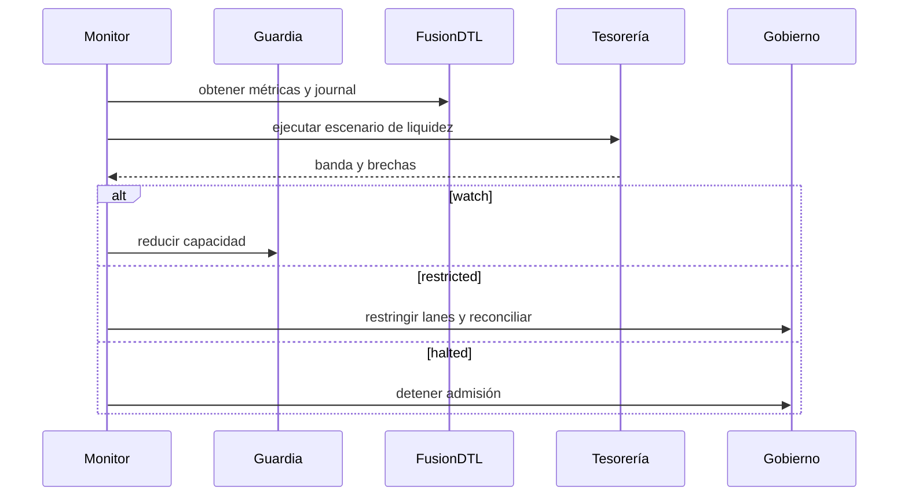
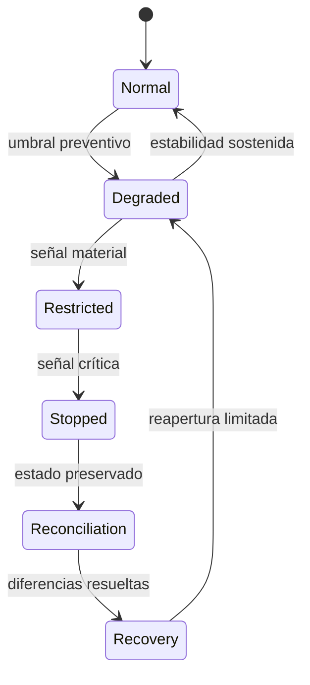

# Seguridad operativa

## Capas de control

La autorización criptográfica no sustituye la política económica. FusionDTL
combina identidad, rol, perfil, época, ruta, capacidad, riesgo y conservación.

Cada capa puede rechazar la operación. Los errores se propagan sin reemplazar
el resultado por valores por defecto.

## Separación de funciones

| Función              | Responsabilidad                 | Separación recomendada          |
| -------------------- | ------------------------------- | ------------------------------- |
| emisor               | originar obligaciones           | no controla riesgo ni tesorería |
| beneficiario         | autorizar settlement            | no administra celdas            |
| relayer              | transportar y cotizar ejecución | no modifica recibos             |
| controlador de celda | financiar y operar capacidad    | no publica precios              |
| administrador riesgo | límites globales                | aprobación múltiple             |
| tesorería            | comisiones y cobertura          | reconciliación independiente    |
| publicación          | promover commits                | no altera el artefacto          |

## Monitores

- edad, desviación y confianza de cada observación de precio;
- perfiles cercanos a vencimiento y roles concedidos;
- nonces rechazados por cuenta;
- recibos pendientes por época y antigüedad;
- reservas, obligaciones y utilización por celda;
- volumen `issued`, `settled`, `routed_in` y `routed_out`;
- cobertura, déficit y concentración estresados;
- comisiones frente a política;
- divergencia entre suministro observado y registrado;
- digest y secuencia del journal;
- commit ejecutado frente a publicación autorizada.

## Contención

1. bloquear nuevas emisiones en las lanes implicadas;
2. preservar configuración, precios, journal y estado;
3. inventariar recibos abiertos y paquetes procesados;
4. reconciliar balances, celdas y custodia;
5. calcular exposición económica por participante y celda;
6. preparar corrección y regresión;
7. promover un artefacto nuevo y reabrir con límites reducidos.

## Lista previa a ventana

- [ ] configuración y commit aprobados;
- [ ] perfiles y roles vigentes;
- [ ] precios actuales y dentro de desviación;
- [ ] lanes y quotes dentro de época;
- [ ] reservas reconciliadas con custodia;
- [ ] cobertura y concentración dentro de política;
- [ ] alertas y responsable de guardia activos;
- [ ] procedimiento de cierre probado.
